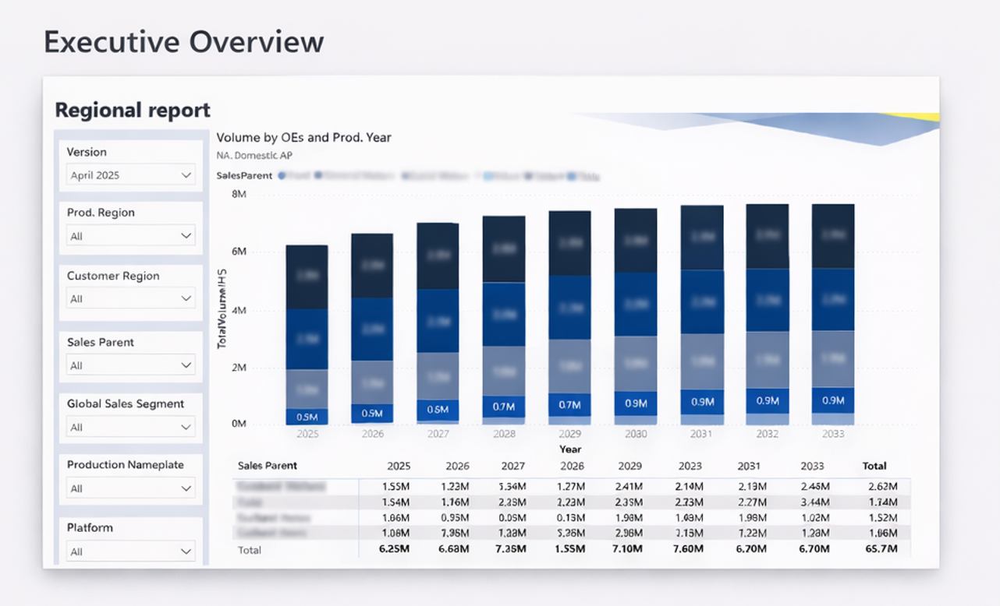
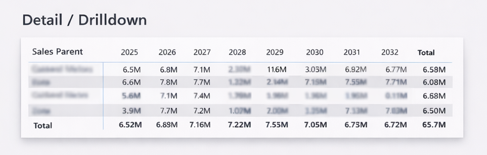

# Executive KPI Dashboard (Power BI)

  
  
  
  

---

## Overview

A production-style executive dashboard built in Power BI to monitor commercial and operational performance across regions and product segments.

The solution follows a **semantic model–first approach**, combining a clean star schema with structured DAX measures to deliver scalable, decision-ready reporting.

---

## Key Capabilities

- Executive KPI framework (Revenue, Volume, Margin, Operational metrics)
- Multi-year performance tracking with YoY and MoM variance analysis
- Drill-through navigation for root cause analysis
- Structured measure layer for maintainability and reuse
- Performance-optimized data model and relationships
- Clean UX designed for leadership consumption

---

## Architecture

- **Data Preparation:** Power Query (transformation, shaping, standardization)
- **Data Model:** Star schema (Fact + Conformed Dimensions)
- **Calculation Layer:** DAX measures (time intelligence, variance, contribution)
- **Visualization Layer:** Executive summary + analytical breakdown + detail view

---

## Business Value

- Enables faster executive decision-making through consolidated KPI visibility
- Reduces manual reporting effort with refresh-ready datasets
- Improves analytical depth via drilldowns and contribution analysis
- Supports scalable self-service reporting through structured modeling

---

## Screenshots

### Executive Overview

---

### Trends & Breakdown

---

### Detail / Drilldown

---

## Technical Highlights

- Time intelligence patterns (YTD, YoY %, Rolling trends)
- Variance analysis (Actual vs Target)
- Contribution analysis across hierarchical dimensions
- Clean model design (controlled relationships, optimized measures)
- Scalable naming conventions and measure organization
